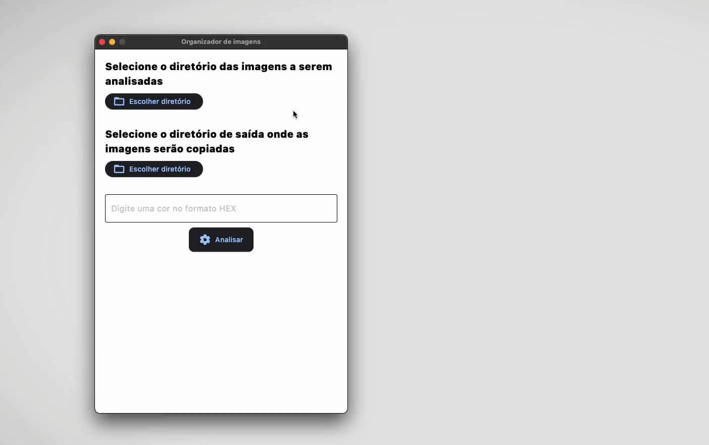
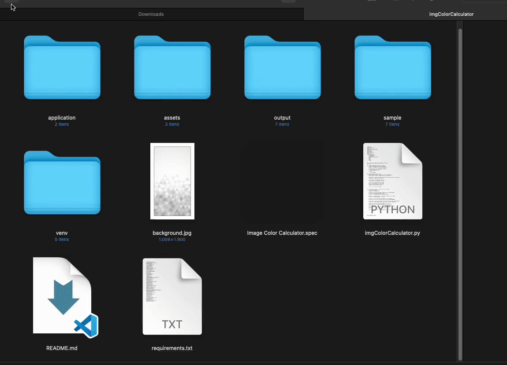

<div style="text-align:center"></div>

# Organizador de Imagens

O Organizador de Imagens é uma aplicação Python que permite analisar imagens em busca de uma cor específica em formato HEX e copiar as imagens que contenham essa cor predominante para um diretório de saída selecionado. Ele usa a biblioteca Flet para criar uma interface de usuário amigável.

## Exemplos

Selecione o diretório `sample` como diretório de entrada e `output` como diretório de saída. Digite a cor `#FF0000` (vermelho) e clique em `Analisar`. 



O programa irá salvar os arquivos no diretório `output` ordenando pelos que possuem a maior porcentagem da cor `#FF0000` presente em seus pixeis.




## Funcionamento

O programa funciona da seguinte maneira:

1. Você seleciona um diretório de entrada que contém as imagens que deseja analisar.
2. Você seleciona um diretório de saída onde as imagens com a cor predominante serão copiadas.
3. Você insere a cor que deseja procurar no formato HEX (por exemplo, #FF0000 para vermelho).
4. Você clica no botão "Analisar" para iniciar o processo de análise.
5. O programa analisa todas as imagens no diretório de entrada em busca da cor especificada.
6. As 100 imagens que contenham a cor predominante (ordenadas pela taxa de incidência da cor na imagem) são copiadas para o diretório de saída.
7. Um relatório é gerado na interface do usuário, exibindo os detalhes das imagens analisadas.

## Uso

Siga estas etapas para usar o Organizador de Imagens:

1. Clone o repositório ou baixe os arquivos para o seu computador.
2. Abra um terminal e navegue até o diretório onde o projeto está localizado.

### Habilitar o Virtual Environment

Ative o ambiente virtual:

**Windows:**

```bash
venv\Scripts\activate
```

**Linux/macOS:**

```bash
source venv/bin/activate
```

### Instalar as Dependências

Instale as dependências do projeto usando o seguinte comando:

```bash
pip install -r requirements.txt
```

### Executar o Programa

Agora, você pode executar o programa com o seguinte comando:

```bash
flet run imgColorCalculator.py
```

Isso abrirá a interface de usuário do Organizador de Imagens em seu navegador padrão.

### Gerar um Executável

Você pode gerar um executável do programa para o seu sistema operacional usando o comando `flet pack`. Isso criará um executável que pode ser executado sem a necessidade de um ambiente Python.

```bash
flet pack imgColorCalculator.py
```

O executável será criado no diretório `dist` e você poderá executá-lo diretamente.

## Licença

Este projeto é distribuído sob a licença GPL (GNU General Public License).

